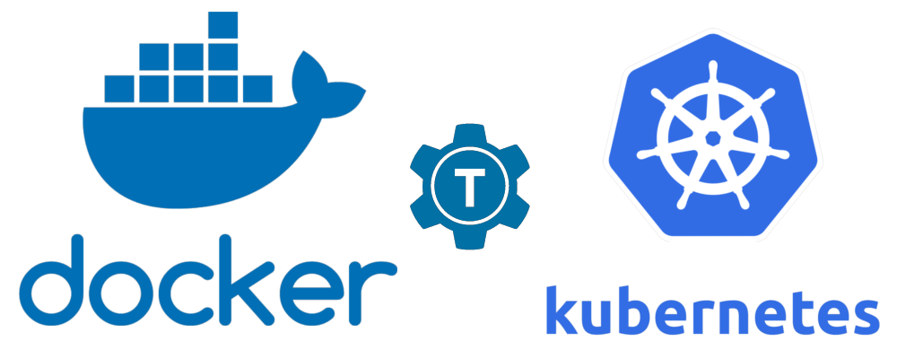

# About

[](https://goreportcard.com/report/github.com/nivenly/kamp)

#### Amplifying Kubernetes development, building, and debugging.

`kamp` is a command line tool that allows a user to easily mount a local directory directly inside a Kubernete's pod of their choice.

`kamp` will deploy a storage broker container in tandem with a container of your choosing, then mount your local filesystem over a reverse SSH tunnel on the broker's filesystem.
The broker will then serve the newly mounted filesystem over `NFS` directly to your container as a Kubernetes `VolumeMount`.

`kamp` allows a user to build, debug, and run a container directly in Kubernetes, and optionally push it to a docker registry upon completion.

<p align="center">
   </image>
</p>


# Friends of kamp

`kamp` is built using open source libraries from the following projects. Thanks to the author's contained within for their hard work.

- [Kubernetes](https://github.com/kubernetes/kubernetes)
- [The Moby Project](https://github.com/moby/moby) (Previously Docker)
- [Teleport](https://github.com/gravitational/teleport)

### Installing kamp

Clone the repository and run `make`

```bash
make
```

### Examples

See the [examples](docs/examples.md) file for examples of how to run and use `kamp`.